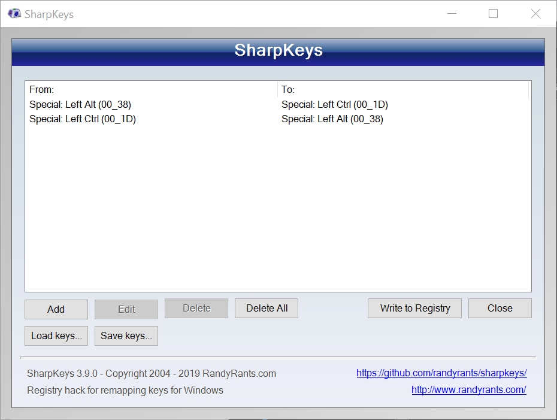

# windows-macos-keyboard-layout

This repository uses SharpKeys and AutoHotkey to make the keyboard macOS like on Windows.

SharpKeys will be used to switch CTRL and ALT keys. AutoHotkey will be used to remap keys like they are on macOS.

This AutoHotkey has also hotkeys for using german special characters on US layout keyboards similar to macOS usage.

# Requirements

- SharpKeys
- AutoHotkey

# Initialization

Please use SharpKeys Software first to switch the left CTRL and ALT keys.



# Usage

Open your startup folder with ```WIN+R``` and insert ```shell:startup```.

Move the osx.ahk file to previously openend startup folder. Now the AutoHotkey script will be started on every startup. You can start the script now to use it.
